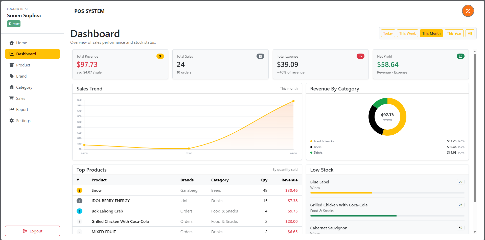
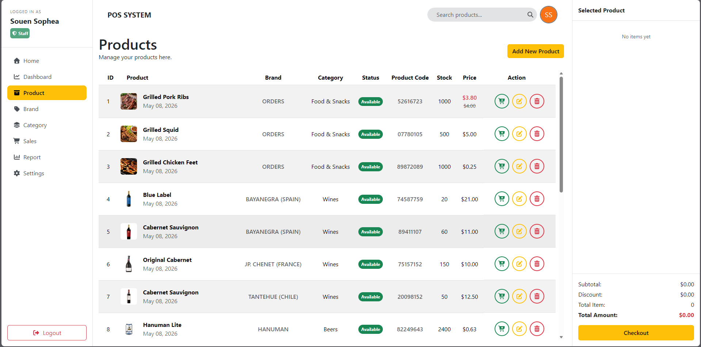
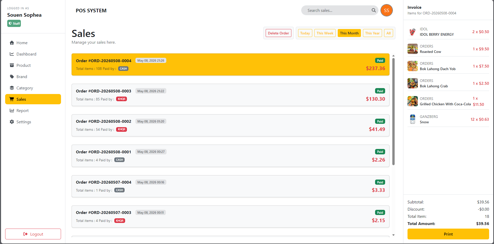
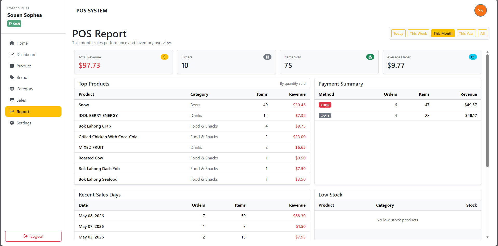

# 🏪 Django POS System - Point of Sale

[](https://python.org)
[](https://djangoproject.com)
[](https://opensource.org/licenses/MIT)
[](https://github.com/psf/black)


A complete **Point of Sale (POS) System** built with Django for retail businesses. Manage products, process sales, track inventory, and generate reports with an intuitive interface.

## 📸 Screenshots

| Dashboard | Product Management |
|-----------|-------------------|
|  |  |

| Sales Interface | Reports |
|----------------|---------|
|  |  |

## ✨ Features

### Core Features
- 🛍️ **Product Management** - Add, edit, delete products with images
- 💰 **Sales Processing** - Quick and easy checkout system
- 📊 **Inventory Tracking** - Real-time stock management
- 👥 **Customer Management** - Track customer purchase history
- 📈 **Sales Reports** - Daily, monthly, and yearly reports
- 🖨️ **Receipt Printing** - Print Invoice

## 🛠️ Technology Stack

### Backend
- **Django 4.2+** - Web framework
- **SQLite/PostgreSQL** - Database
- 
### Frontend
- **HTML5** - Structure (1.7%)
- **CSS3** - Styling (0.7%)
- **JavaScript** - Interactivity (2.8%)
- **Bootstrap 5** - Responsive design
- **Chart.js** - Data visualization

### Tools
- **Git** - Version control
- **PowerShell** - Automation scripts (0.1%)
- **Batchfile** - Windows utilities (0.0%)

## 📋 Prerequisites

- Python 3.8 or higher
- pip (Python package manager)
- Virtual environment (recommended)
- Git

## 🚀 Installation

### 1. Clone the repository

```bash
git clone https://github.com/your-username/POS.git
cd POS### 2. Install dependencies

```bash
pip install -r requirements.txt

### 3. Run the server

```bash
python manage.py runserver
